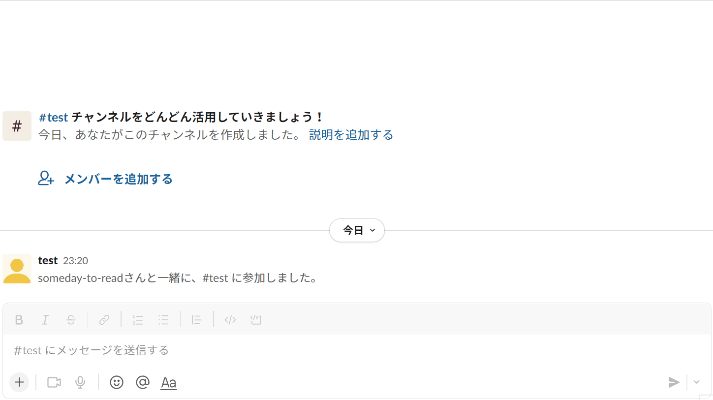

# someday-to-read
好きなキャラクターがあなたの積読を管理！



# 機能
- slackからの操作
- ウェブ記事などのURLとメモの保存
- ランダムピックアップ
- カスタイマイズ可能な通知のセリフ
- AWSの無料枠でホスティング可能

# 起動
## slackの設定
slackのアプリケーションフレームワークである[boltの指示](https://slack.dev/bolt-js/ja-jp/tutorial/getting-started)に従って、ボットトークンを取得してください。
権限は`chat:write`と`commands`を設定する必要があります。
## アプリケーションの設定
slackのトークンを
```.env
SLACK_SIGNING_SECRET=xxxxxx
SLACK_BOT_TOKEN=xoxb-xxxxxx
```
に設定してください。

[serverless framework](https://www.serverless.com/)を利用できる環境を用意して、
```
npm install
npm run deploy
```
コマンドを実行してください。実行後ログに表示されるendpointのURLをひかえてください。

## slackとアプリケーションの連携
上記で控えたURLをslackのアプリ設定画面の
- `Interactivity & Shortcuts` の `Request URL`
- `Event Subscriptions` の `Request URL`

に保存してください。
また、`Slash Commands` に `/st-save` と `st-pick` のコマンドを追加し、その`Request URL` にもURLを保存してください。

また、`st-pick` の`Usage Hint`に`[book, web]` を追加してください

その後、ボットを使いたいチャンネルにボットを追加し、コマンドを実行するとアプリが利用できるはずです。

# カスタイマイズ
`.env`ファイルを編集することで、通知のメッセージを変更することができます。`,`区切りでメッセージを記述することで、ランダムメッセージにも対応可能です。
```.envの例
MESSAGE_SAVE=覚えておく
MESSAGE_PICK=これがおすすめ,これがいいよ
MESSAGE_DONE=よみおわったの。わかった。
MESSAGE_NOT_FOUND=見つけられなかった
MESSAGE_FAIL=失敗した
```

アプリの画像などを変更することで、それっぽさをあげることができます。
